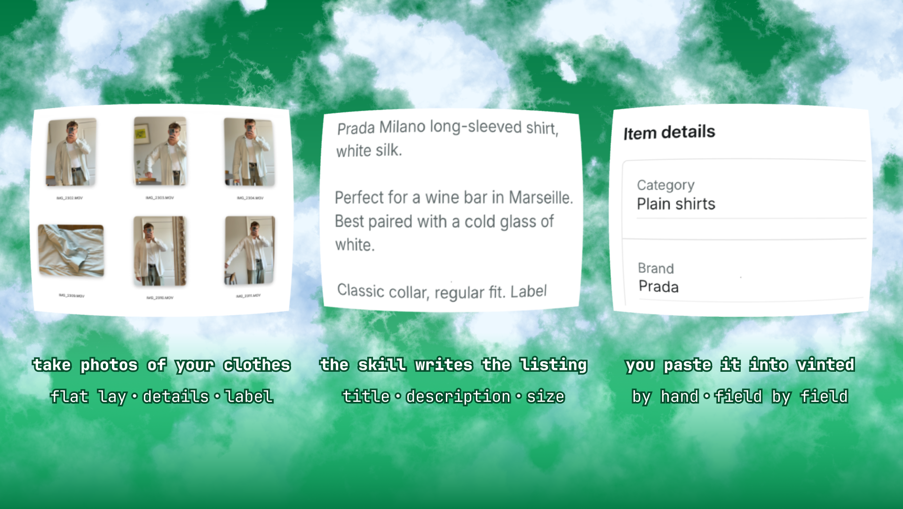

# 🏷️ Vinted Listing



**An agent skill that turns phone photos of your clothes into ready-to-paste Vinted listings.**

Clearing out a wardrobe means 30 items to photograph, 300 photos to sort through and 30 descriptions to write, and it's the descriptions that turn a Saturday afternoon into a pile that sits in the corner for a year. This reads the photos and writes them for you.

Works with iPhone or Android photos on macOS, Windows or Linux.

Requirements: an agent that can read files and view images, such as Claude Code, Codex, Cursor or Copilot. On Windows or Linux, run `python3 -m pip install -r requirements.txt` first; macOS already has everything it needs.

## Steps

**1. Clone the repo and open the folder in your agent.**

```bash
git clone https://github.com/stefanmanojlovic2/vinted-listing.git
```

**2. Put your photos in `inbox/`.** Take a bunch of photos of each piece: the whole thing, close details, the label, any flaws. Order doesn't matter and subfolders are fine.

**3. Ask it to sort them out.** It looks at every photo, works out which shots belong to the same garment even when they're scattered across the roll, and gives each one a number and a name. It shows you the groups before it moves a single file, so you can correct it first:

```
001 levis-501-jeans: IMG_0001, IMG_0004, IMG_0005, IMG_0007:label
002 nike-tank-grey:  IMG_0002, IMG_0003, IMG_0006:label
Unsorted: IMG_0008 (blurry)
```

Anything it can't place goes to `items/_unsorted/` for you to look at. If it gets a group wrong later, edit `source_photos` in `listings.json` and run `python3 scripts/vinted.py organise` again.

**4. Ask it to write the listings.** It reads the label for the brand, size and material, names every flaw it can see and where on the garment it is, and fills in every field the Sell form asks for. It writes five and stops, so you can read the closing lines and reject the ones that don't sound like you before it repeats them across another forty items.

**5. Paste them into Vinted.** Open `listings.md`, find the item by its number, and copy the block into the Sell form. Everything the form asks for is in there, apart from the price — Vinted shows you what similar pieces sold for, so set it there.

## What comes out

| Field | Value |
|---|---|
| Title | Levi's 501 straight jeans mid blue |
| Category · Brand | Straight fit jeans · Levi's |
| Size · Condition | W32 L32 · Good |
| Colours · Material | Blue · Denim |
| Parcel size | Medium |

```
Levi's 501 straight leg jeans in mid blue denim. Button fly, red tab on the back pocket.

Bought them a size down and never grew into them.

Label size W32 L32, true to size. Good condition, light fading on the knees. 100% cotton.
```

The middle line is the closing line. That one's an example; yours comes out of [TASTE.md](TASTE.md), in your words.

## How the voice works

The facts come straight off the photos and it gets those right on its own. What it can't guess is the one line in the middle that sounds like a person wrote it, so that half has to come from you.

You teach it by saying no. Reject a line, say why in a few words, and both the line and your reason go into `TASTE.md` for the next batch to work from. Three items of that is usually enough.

## What it won't do

- **Overwrite copy you've already got**, unless you say "rewrite".
- **Send your photos anywhere.** They stay in the folder. The agent reads small local previews, and the originals only move when you upload them. If Vinted refuses your HEIC files, `python3 scripts/heic_to_jpg.py` makes JPEG copies that carry no EXIF, so no GPS.
- **Touch Vinted.** You do the uploading.

## Repo structure

```
vinted-listing/
├── SKILL.md      how photos get grouped and listings written
├── TASTE.md      your format and voice rules
├── AGENTS.md     what an agent reads when you open the folder
├── scripts/      organise, check, render, previews, JPEG copies
├── inbox/        drop your photos here
└── items/        sorted photos, plus listings.json and listings.md at the root (gitignored)
```

Your photos and your listings are in `.gitignore`. Fork this and push, and they still don't leave your machine.

## License

MIT — see [LICENSE](LICENSE).

---

Built by Stefan Manojlovic ([https://www.linkedin.com/in/stefanmanojlovic2/](https://www.linkedin.com/in/stefanmanojlovic2/?skipRedirect=true)), Marketing at [Snitcher](https://www.snitcher.com/?utm_medium=social&utm_source=github&utm_content=stef-profile)
